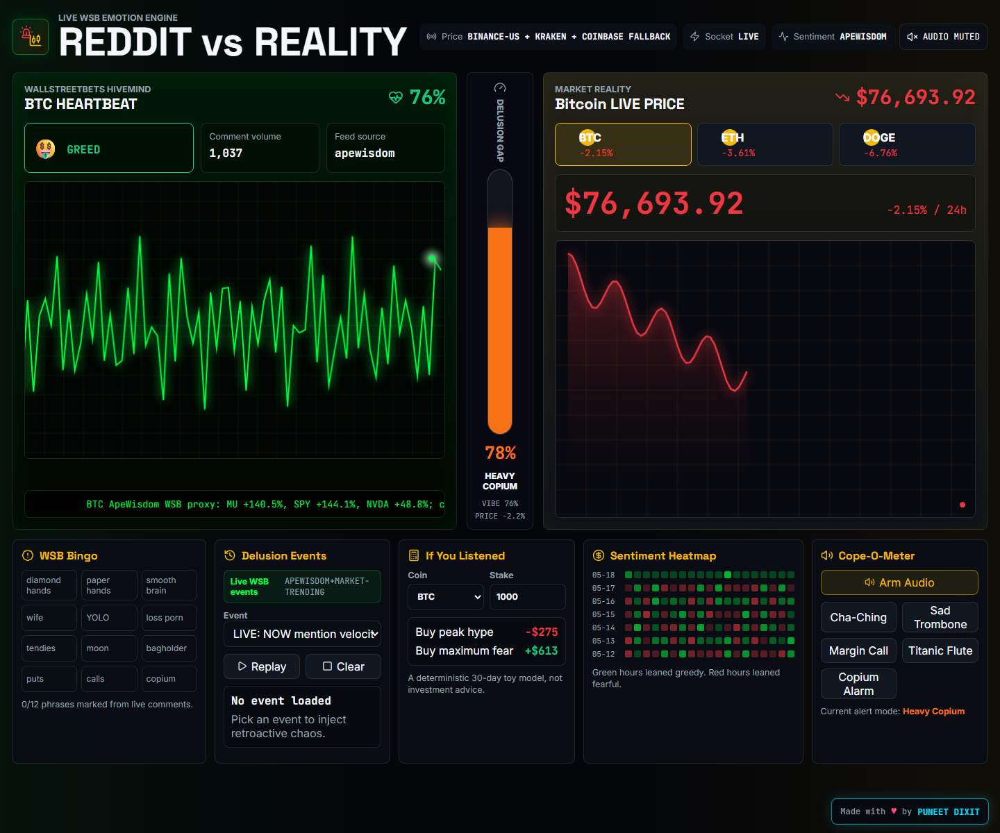

# REDDIT vs REALITY

Live data-art dashboard that compares WallStreetBets hype against crypto market reality.



## What Users Get

- A split-screen WSB emotion monitor and live market dashboard.
- A heartbeat-style EKG chart driven by real ApeWisdom WallStreetBets mention momentum.
- BTC, ETH, and DOGE market prices from CoinGecko, plus live Coinbase WebSocket ticks.
- A center "Delusion Gap" gauge that compares crowd sentiment with actual 24h price movement.
- Live delusion events from ApeWisdom, Yahoo Finance trending symbols, and CoinGecko trending crypto.
- WSB bingo, historical delusion replay, sentiment heatmap, and an "If You Listened" calculator.
- Desktop and mobile responsive UI with Playwright coverage.

## Data Sources

| Source | Used For | Reliability |
| --- | --- | --- |
| ApeWisdom | WSB ticker mentions, upvotes, rank, 24h mention changes | Good for attention and hype. Sentiment is inferred, not raw comment analysis. |
| CoinGecko | Crypto market prices, 24h changes, charts, trending crypto | Good for display and research dashboards. Not for trade execution. |
| Coinbase WebSocket | Live BTC/ETH/DOGE ticker updates | Good live exchange ticker data for UI updates. |
| Yahoo Finance Trending | Backup live event signals | Useful public trend signal, but unofficial and can change. |
| Binance US, Kraken, Coinbase spot | Price fallbacks if CoinGecko is unavailable | Good fallback display sources. |
| Synthetic fallback | Last-resort UI continuity | Keeps the app usable, but source badges expose fallback mode. |

## How It Works

1. `/api/sentiment` fetches ApeWisdom WSB mention data.
2. The app converts mention velocity, rank movement, and upvotes into a WSB mood score.
3. `/api/prices` fetches CoinGecko market data and falls back to other price providers if needed.
4. The browser opens Coinbase WebSocket and updates the price chart when real ticker messages arrive.
5. `/api/events` builds live event cards from ApeWisdom, Yahoo Finance trending, and CoinGecko trending.
6. The Delusion Gap compares normalized WSB sentiment against the selected coin's 24h price change.

## Local Development

```bash
npm install
npm run dev
```

Open `http://localhost:3000`.

## Verification

```bash
npm test
npm run lint
npm run build
npm run test:e2e
```

The e2e suite expects the app to be available at `http://localhost:3000`. Override with `PLAYWRIGHT_BASE_URL`.

## Data Notes

This is an entertainment and data-art project, not an investing tool. The price data is suitable for a dashboard view, while the WSB side is an inferred attention signal. Source badges show whether data is live, degraded, or fallback.

## Vercel

This repo is Vercel-ready. Vercel auto-detects Next.js; `vercel.json` pins the build and install commands.
